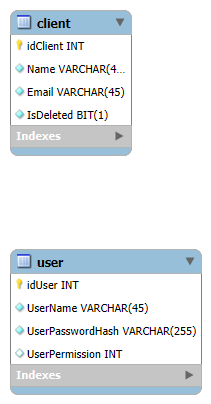

# ABM de Clientes - Proyecto Web Full Stack

Este es un proyecto web full stack que permite gestionar clientes a través de una aplicación ABM (Alta, Baja y Modificación).
Está construido con Angular en el frontend y .NET Core con Entity Framework y MySQL en el backend.

El código también contiene rastros de un sistema de autenticación (Login) que no llegó a implementarse, pero podría expandirse en el futuro.

# Tecnologías Utilizadas

Frontend (Angular)

PrimeNG. Librería de componentes UI para mejorar la interfaz.

Formularios Reactivos. Manejo avanzado de formularios con validaciones.

Tabla con filtros. Implementación de ordenamiento y búsqueda.

NgRx (Redux en Angular). Gestión del estado global.

Backend (.NET Core)

Patrón Repository. Abstracción de acceso a datos.

Patrón Service. Lógica de negocio centralizada.

AutoMapper. Mapeo automático entre entidades y DTOs.

Entity Framework Core + MySQL. ORM para comunicación con la base de datos.

Inyección de Dependencias. Gestión eficiente de servicios.

# Funcionalidades

- Listar clientes con filtros y ordenamiento.

- Agregar clientes mediante formularios reactivos.

- Editar clientes con validaciones en tiempo real.

- Eliminar clientes, soportando borrado lógico.

- Manejo de estado con NgRx para mejor rendimiento.

- Validaciones y manejo de errores en frontend y backend.

# Arquitectura de la Base de Datos

# Puertos del Proyecto

- Backend: http://localhost:7242/api

- Frontend: http://localhost:4200

# Mejoras Futuras

- Implementar autenticación y autorización para usuarios.

- Optimizar el rendimiento del frontend.

- Agregar tests unitarios en Jest y XUnit.
